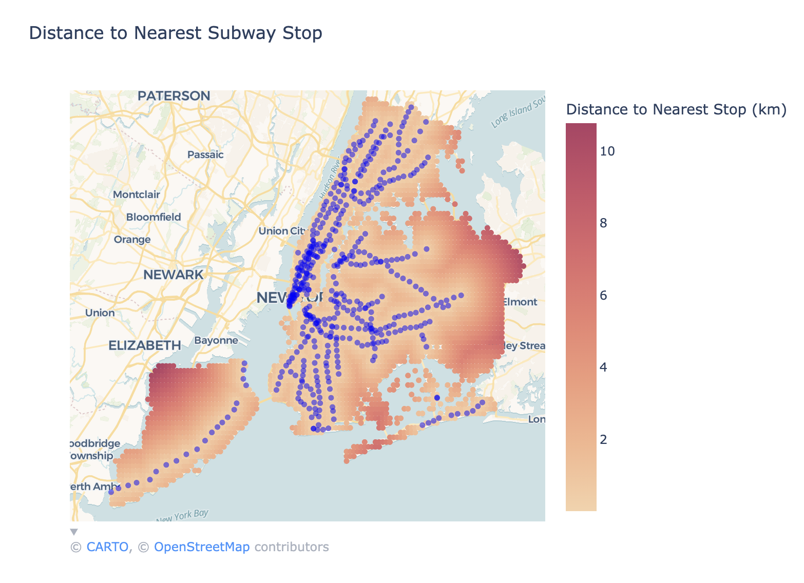
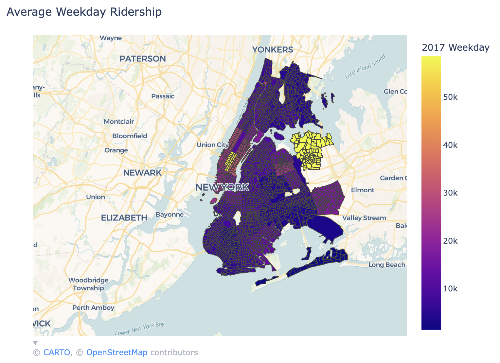
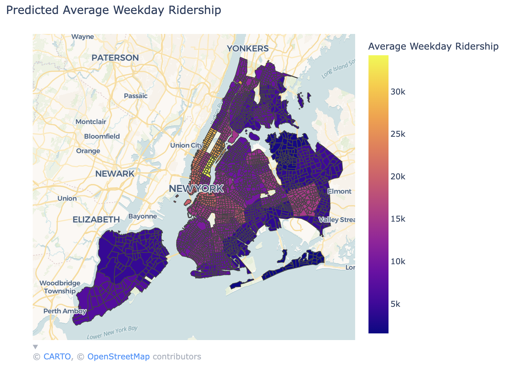
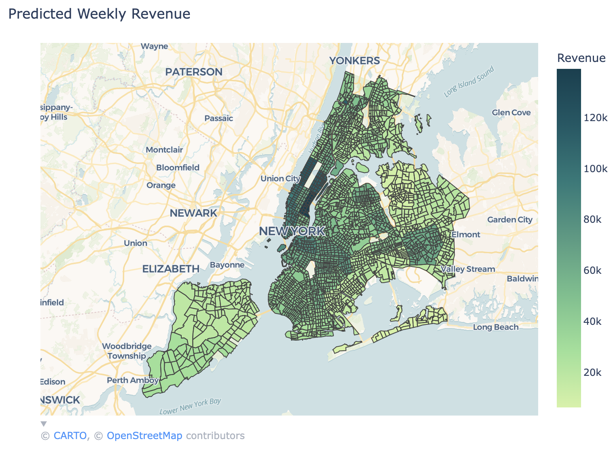
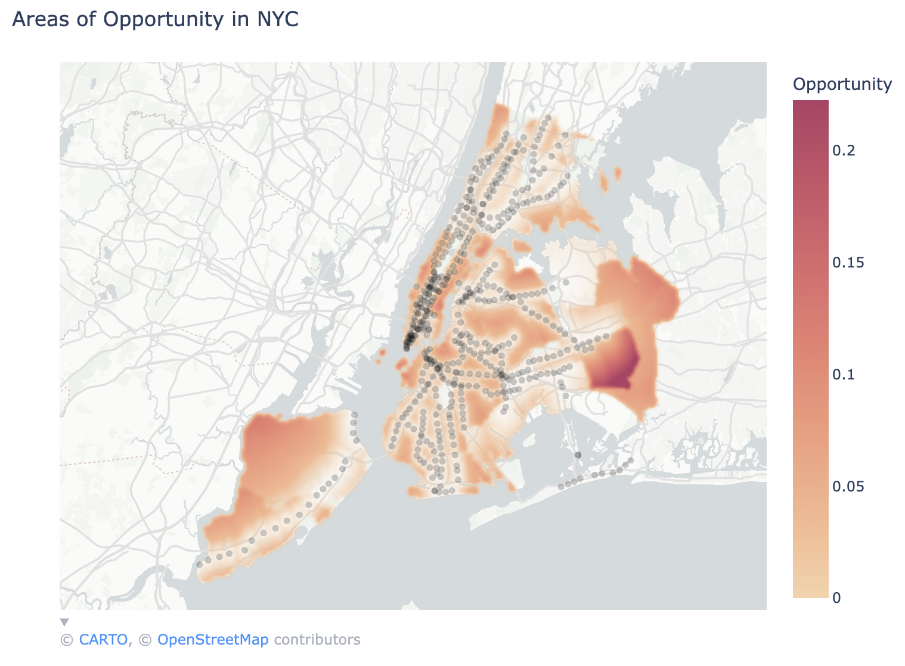

# About

In this project, we identified areas in New York City (NYC) that are underrepresented in transit accessibility. We wanted to understand areas of opportunity (defined as currently underserved areas where we predict people would have high public transportation usage) where the MTA could create a transit station that we believe will receive a lot of foot traffic and ticket sales. 

To solve this problem, we determined the average distance to a transit station from areas all over NYC. We then determined if the area is worth investing in (would a transit station here be profitable?) by looking at predicted ridership. Each subway ride in NYC earns $2.90 per ride per person (https://www.mta.info/fares-tolls/subway-bus), and since we can predict weekly ridership, we will predict weekly revenue based on that predicted ridership.

Our data science approach will not only enable us to identify underserved areas but also to predict ridership for these areas. The resulting decision-making platform will enable the MTA to more readily evaluate potential locations for transit stops/stations rather than having to manually sort through all options. 

# Results

## Identifying Underserved Areas

To identify underserved areas, we used the average distance to a subway station as a proxy for accessibility. We calculated the average distance to a subway station for points all over NYC, and then we plotted the results. The areas with the highest average distance to a subway station are the most underserved areas.

|  |  |
|---------------------------------------|---------------------------------------|
| **Ground Truth Ridership**                | **Predicted Ridership**                |

We next constructed a model to predict weekly ridership based on demographics data like median income and population density. This data came from NYC census data, so predictions are for census tracts. We tried a few different models, but the best performing model was a Random Forest Regressor, with an R^2 of 0.675 (on 10-fold cross-validation).

The two maps above show the ground truth ridership and the predicted ridership. There are a few notable differences, in particular, some areas have one stop with high ridership, but since the values reflect on the entire census tract, the ground truth prediction is much higher for those areas.

We also computed the predicted revenue for each census tract based on the predicted ridership. The map above shows the predicted revenue for each census tract. 

Our final result is a map of the areas of opportunity, which is the product of the average distance to a subway station and the predicted revenue (both normalized to a range of 0-1). The areas with the highest values are the areas that are most underserved and have the highest predicted revenue.

We discuss these results further in our report and presentation, linked below.

**Report:** https://docs.google.com/document/d/1vnjbzVh_RYYclWAOj0efJ_VCKNdW5mEic235lsq59Hc/edit?usp=sharing

**Slides:** https://docs.google.com/presentation/d/1bggkTmrDGwmAPLfzoR553Cgrc8w8DcQyCdhVLl1KfVM/edit?usp=sharing

# Datasets

### NYC Census Data
https://data.cccnewyork.org/data/download#0,8,10/66,97

Note: Fips codes represent location.

Critical Note: There are aggregate rows in the dataset. There is a row for NYC, but then there are also rows for each borough
and then also each community district in each borough. 

For Median Incomes, for example, you will want to look at Household Type, since there are multiple values for each location
based on the type of household. Similar problems exist for total population by age group and ethnicity.

### NYC Transit Data
https://www.mta.info/developers

### Community Districts
Community Districts
https://boundaries.beta.nyc/?map=cd&dist=208

GeoJSON: https://www.nyc.gov/content/planning/pages/resources/datasets/community-districts

### Census Data for Aligning FIPS to Community Districts
https://data.cityofnewyork.us/City-Government/2020-Census-Tracts/63ge-mke6/data_preview

### Historic Ridership Data

Data with Latitude and Longitude: https://public.tableau.com/views/NYCSubwayRidership/Summary?:embed=y&:showVizHome=no&:host_url=https://public.tableau.com/&:embed_code_version=3&:tabs=yes&:toolbar=yes&:animate_transition=yes&:display_static_image=no&:display_spinner=no&:display_overlay=yes&:display_count=yes&publish=yes&:loadOrderID=1

Original Data https://www.mta.info/agency/new-york-city-transit/subway-bus-ridership-2022

# Development

Uses the uv python package manager to install the dependencies. 

Use `uv sync` to install the dependencies and create the virtual environment.

You can select the python interpreter from `.venv` in VSCode, and then run the code in the terminal.

Use `uv add <package>` to add a new package to the project. This is preferred to using pip directly.

# Usage

Run `uv run python main.py` to run the project. This will run the main.py file in the current directory.